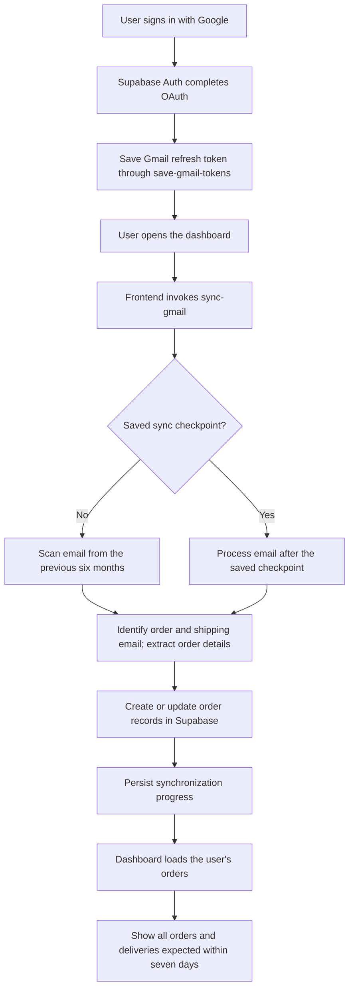

# AutoTracker

AutoTracker brings order and delivery information from Gmail into one dashboard. After signing in with Google, the app synchronizes relevant purchase and shipping emails, uses AI to identify and extract order details, and presents the resulting orders and upcoming deliveries.

**Production app:** [app-autotracker.vercel.app](https://app-autotracker.vercel.app)

## What it does

- Authenticates users with Google through Supabase Auth.
- Requests read-only Gmail access; AutoTracker does not send, modify, or delete email.
- Scans the previous six months of email when no synchronization checkpoint exists.
- Stores synchronization progress and, on later dashboard visits, processes email after the saved checkpoint instead of rescanning the full history.
- Uses AI to identify order confirmations and shipping updates and extract order information.
- Saves and updates recognized orders in Supabase for the signed-in user.
- Shows the order list, sortable by its displayed order attributes, and highlights deliveries expected in the next seven days.
- Displays order, company, and carrier details where available.

## Synchronization flow

The frontend repeats calls to `sync-gmail` while the function reports that more messages remain and that the current call made progress. The synchronization checkpoint is exposed to the app through `sync_state.last_synced_at`.

## Architecture

AutoTracker is a Vue single-page application backed by Supabase. The frontend owns sign-in, route access, starting synchronization, loading the signed-in user's orders, and presenting them. Gmail synchronization and refresh-token handling are delegated to Supabase Edge Functions.

| Component                         | Responsibility                                                                                  |
| --------------------------------- | ----------------------------------------------------------------------------------------------- |
| Vue application                   | Landing page, sign-in flow, protected dashboard, order views, and legal pages                   |
| Supabase Auth                     | Google OAuth sign-in and the authenticated user session                                         |
| `save-gmail-tokens` Edge Function | Receives the Google provider refresh token after sign-in when one is present                    |
| `sync-gmail` Edge Function        | Processes Gmail messages for synchronization and writes recognized order data to Supabase       |
| Supabase database                 | Persists user-associated orders and synchronization state                                       |
| Vercel                            | Hosts the production single-page application; its rewrite serves the app entry point for routes |

The Edge Function implementations and database migrations are managed outside this frontend repository and are not included here.

## Order data

The database `orders` records are mapped to the app's `AppOrder` model. Available fields include:

| App field                   | Stored data                               |
| --------------------------- | ----------------------------------------- |
| `merchant`                  | Merchant name                             |
| `orderNumber`               | Merchant order identifier                 |
| `total`, `currency`         | Order amount and currency                 |
| `trackingNumber`, `carrier` | Shipment tracking details, when available |
| `company`                   | Company associated with the order         |
| `status`                    | Current order or shipment status          |
| `estimatedDelivery`         | Estimated delivery date, when available   |
| `createdAt`                 | Order record creation time                |

The underlying order record also associates each order with a user and can retain the Gmail message identifier and record update time. Nullable order details are shown as unavailable rather than assumed to exist.

The dashboard's **Upcoming deliveries** section includes orders with an estimated delivery from the current time through the next seven days. The full order list can be sorted by company, merchant, tracking number, carrier, status, estimated delivery, and total.

## Application routes

| Route        | Page                           | Access                                                  |
| ------------ | ------------------------------ | ------------------------------------------------------- |
| `/`          | Redirects to the home page     | Public                                                  |
| `/home`      | Product landing page           | Public                                                  |
| `/login`     | Google sign-in                 | Guests; signed-in users are redirected to the dashboard |
| `/dashboard` | Orders and upcoming deliveries | Requires authentication                                 |
| `/terms`     | Terms of Service               | Public                                                  |
| `/privacy`   | Privacy Policy                 | Public                                                  |
| `/cookies`   | Cookie Policy                  | Public                                                  |
| Other paths  | Not found page                 | Public                                                  |

## Technology

- Vue 3 and TypeScript
- Vite
- Vue Router
- Element Plus
- Supabase JavaScript client, Auth, database, and Edge Functions
- Vercel deployment

## Gmail permission and data handling

Google sign-in requests the `gmail.readonly` scope. The app's OAuth flow returns to the dashboard. When Google supplies a provider refresh token, the frontend passes it to `save-gmail-tokens` so the backend can support Gmail synchronization. Gmail synchronization is initiated when the dashboard loads; this repository does not implement a background mail listener.

For the service's stated data-handling terms, see the in-app [Privacy Policy](https://app-autotracker.vercel.app/privacy), [Terms of Service](https://app-autotracker.vercel.app/terms), and [Cookie Policy](https://app-autotracker.vercel.app/cookies).
